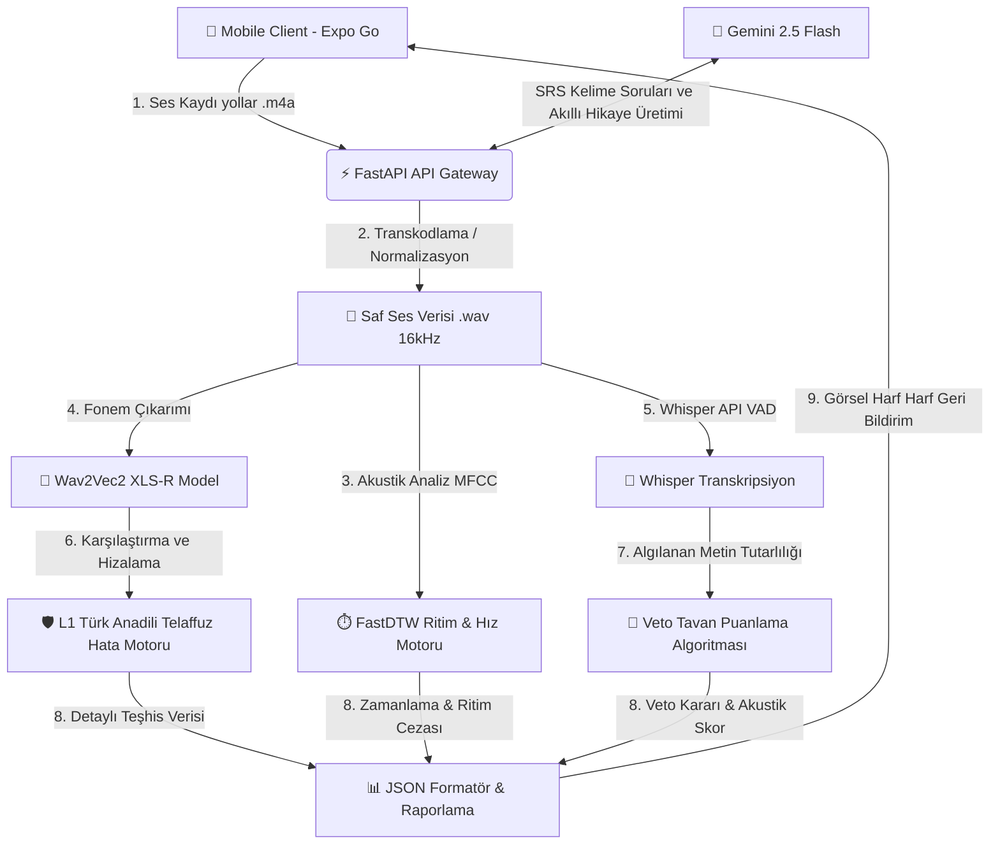

#  DailyWords

[](https://fastapi.tiangolo.com)
[](https://reactnative.dev)
[](https://expo.dev)
[](https://python.org)
[](https://www.postgresql.org)

Yapay zeka destekli, **fonem (ses birimi) seviyesinde** İngilizce telaffuz analizi yapabilen, mikro öğrenme ve aralıklı tekrar (SRS) algoritmalarıyla donatılmış yeni nesil bir dil öğrenme platformudur. 

Bu proje; istemci tarafında modern bir **React Native (Expo)** mobil uygulama, sunucu tarafında ise gelişmiş sinyal işleme ve yapay zeka modelleri barındıran **FastAPI (Python)** servisinden oluşmaktadır.

loom demo videosu: https://www.loom.com/share/82fd60bd7a074f969ce136e477a07f2d


---

## 📐 Sistem Mimarisi ve Akış Şeması

Uygulamanın ses işleme, telaffuz analizi ve yapay zeka akışı aşağıdaki şemada detaylandırılmıştır:



---

## 📂 Proje Dizin Yapısı

Temiz kodlama ve kurumsal standartlara göre düzenlenmiş klasör şeması:

```plaintext
DailyWords/
├── src/                    # Backend Kaynak Kodları
│   ├── app.py              # FastAPI Sunucusu ve Endpoint Tanımlamaları
│   ├── audio_processing.py # Ses Analizi, FastDTW, Wav2Vec2/Whisper Entegrasyonu
│   ├── database.py         # SQLAlchemy ORM PostgreSQL Bağlantısı
│   ├── models.py           # SQL Veritabanı Tablo Şemaları
│   ├── seed.py             # Excel'den Kelime Çekme ve TTS Ses Üretim Aracı
│   └── migrate.py          # Veritabanı Otomatik Sütun Ekleme Yaması
├── models/                 # Yapay Zeka & Dil Konfigürasyonları
│   └── turkish_l1_rules.json # Anadile Özgü (L1) Hata Tanımlama Kuralları
├── docs/                   # Akademik Dokümanlar, Tez ve Sunum PDF'leri
├── assets/                 # Çalışma Esnasında İndirilen Kelime Sesleri (Git Dışı)
├── frontend/               # React Native (Expo) Mobil Uygulama Projesi
│   ├── src/                # Mobil Ekranlar, Temalar ve API Servisleri
│   └── yansit.bat/.ps1     # Geliştiriciler için USB/Wi-Fi Ekran Yansıtma Yardımcısı
├── requirements.txt        # Python Backend Bağımlılık Listesi
├── .env.example            # Çevre Değişkenleri Şablonu
└── README.md               # Proje Ana Kılavuzu
```

---

## 🚀 Kurulum ve Çalıştırma Kılavuzu

Uygulamayı yerel bilgisayarınızda çalıştırmak için aşağıdaki adımları takip edin.

### 🔌 Ön Gereksinimler (Sisteminizde Olması Gerekenler)

> [!IMPORTANT]
> **eSpeak NG Kurulumu:** Fonem analizi motorunun çalışabilmesi için bilgisayarınızda `eSpeak NG` kurulu olmalıdır.
> 1. [eSpeak NG Releases](https://github.com/espeak-ng/espeak-ng/releases) adresinden sisteminize uygun `.msi` paketini indirin.
> 2. Varsayılan yol olan `C:\Program Files\eSpeak NG` dizinine yükleyin.

> [!NOTE]
> **Veritabanı:** Bilgisayarınızda yerel bir **PostgreSQL** sunucusunun çalıştığından emin olun.

---

### 1️⃣ Yapay Zeka Backend (FastAPI) Kurulumu

Yeni bir terminal açın ve projenin ana dizinine geçin:

```powershell
cd c:\Users\hp\Desktop\DailyWords-Repo
```

#### A. Sanal Ortam & Kütüphane Kurulumu

```powershell
# 1. Temiz bir sanal ortam oluşturun
python -m venv venv

# 2. Sanal ortamı aktif edin (PowerShell)
.\venv\Scripts\Activate.ps1

# 3. Gerekli tüm yapay zeka ve sunucu kütüphanelerini yükleyin
pip install -r requirements.txt
```

#### B. Çevre Değişkenleri yapılandırması
1. Ana dizindeki `.env.example` dosyasını `.env` adıyla kopyalayın.
2. PostgreSQL şifrenizi ve Gemini API anahtarınızı girin:

```env
DB_USER=postgres
DB_PASSWORD=veritabanı_şifreniz
DB_HOST=localhost
DB_PORT=5432
DB_NAME=dailywords_db
GEMINI_API_KEY=AIzaSy...
```

#### C. Backend'i Başlatma (Tüm Cihazlara Açık)
Sanal ortamınız aktifken sunucuyu yerel ağdaki telefonunuzun da erişebileceği şekilde başlatın:

```powershell
python -m uvicorn src.app:app --host 0.0.0.0 --port 8000 --reload
```

---

### 2️⃣ Mobil Uygulama (React Native & Expo) Kurulumu

Yeni bir terminal açın ve mobil uygulama dizinine geçin:

```powershell
cd c:\Users\hp\Desktop\DailyWords-Repo\frontend
```

#### A. Paketleri Yükleme & IP Yapılandırması

```powershell
# 1. Node modüllerini yükleyin
npm install
```

2. `frontend/.env` dosyasını açarak `EXPO_PUBLIC_API_URL` adresini bilgisayarınızın yerel ağdaki IP adresiyle güncelleyin:
   *(IP adresinizi öğrenmek için terminalde `ipconfig` komutunu koşturabilirsiniz)*

```env
EXPO_PUBLIC_API_URL=http://<BILGISAYARINIZIN_IP_ADRESI>:8000
```

#### B. Uygulamayı Önbelleği Temizleyerek Başlatma

```powershell
npm start -- -c
```

Terminal ekranında beliren **QR Kodunu** telefonunuzdaki **Expo Go** uygulamasına okutarak test etmeye başlayabilirsiniz.

---

## 🛠️ Olası Bağlantı Sorunları (Troubleshooting)

> [!TIP]
> **Axios Network Error / Kelimelerin Yüklenmemesi Hatası:**
> 1. Telefonunuz ile bilgisayarınızın **aynı Wi-Fi ağına** bağlı olduğundan emin olun.
> 2. Windows Güvenlik Duvarı'nın (Firewall) `8000` portunu engellemediğini kontrol edin.
> 3. `frontend/.env` dosyasındaki IP'nin bilgisayarınızın o anki aktif ağ IP'siyle tam eşleştiğinden emin olun.
> 4. Backend'i çalıştırırken `--host 0.0.0.0` parametresini girdiğinizi teyit edin.
